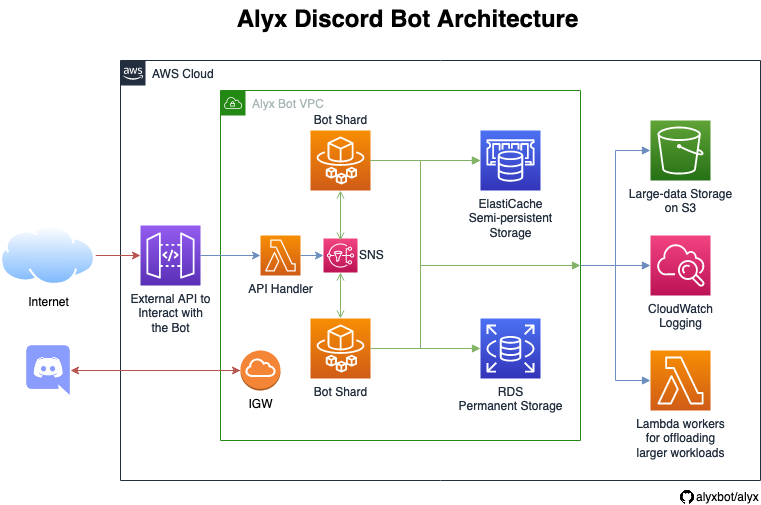

Architecture & Design
=====================

Here's some of the technology stack being used by Alyx:

* **TypeScript:** The primary programming language that Alyx is written in. TypeScript is a superset of JavaScript, and compiles down to JavaScript. You can read more about it here_.
* **NodeJS:** The runtime environment which executes the compiled JavaScript code.
* **discord.js:** A powerful JavaScript library which is the foundation for Alyx's interactions with the Discord API. We believe discord.js is well engineered on its own, so Alyx effectively wraps it, exposing all of its powerful functionality to plugin authors.
* **Docker:** Alyx (or each shard of Alyx if shards are enabled) runs inside its own Docker container, which enables fast and reproducible deployments.
* **AWS:** Alyx was designed to be run on the cloud in a 100% serverless environment, utilizing a wide array of AWS services to facilitate this. Alyx's infrastructure is modeled and deployed to AWS using CDK_.

Architecture
^^^^^^^^^^^^

This image describes a high level architecture of how Alyx is put together on AWS:

VPC
---

The bulk of Alyx's infrastructure runs in a Virtual Private Cloud (VPC), which creates a
network layer between Alyx and the internet. This enables secure communication between
the various services and resources which power the bot, such as databases and compute capacity.

Fargate
-------

AWS Fargate is a serverless compute platform built on top of Amazon ECS (Elastic Container Service)
which allows containers (Docker, in our case) to be deployed without having to maintain
any servers yourself. Fargate allows Alyx to quickly scale as the bot grows.

ElastiCache / Redis
-------------------

Alyx utilizes ElastiCache for semi-persistent data storage and information which needs
to be shared across shards. Specifically, we use Redis as the database engine.

SNS
---

In multi-shard setups, each shard is running in its own container on Fargate, so there needs
to be a way for containers to communicate with each other. This is done via AWS's Simple Notification
Service. Messages can be published by any shard (or dozens of other AWS services) and each shard
will receive and process that message, replying if necessary.

**TODO:** We'll likely need our own basic protocol since shards will need to reply to messages
and not just receive them.

Other Services
--------------

Alyx uses a wide array of other AWS services to piece together the final bot, such as:

* **CloudWatch** to store detailed logging information and error reporting
* **Lambda** to execute offloaded resource-intensive processing work so that bot containers aren't impacted.
* **S3** for long-term persistent storage of large data.

.. _here: https://typescriptlang.org
.. _discord.js: https://discord.js.org
.. _CDK: https://aws.amazon.com/cdk/
